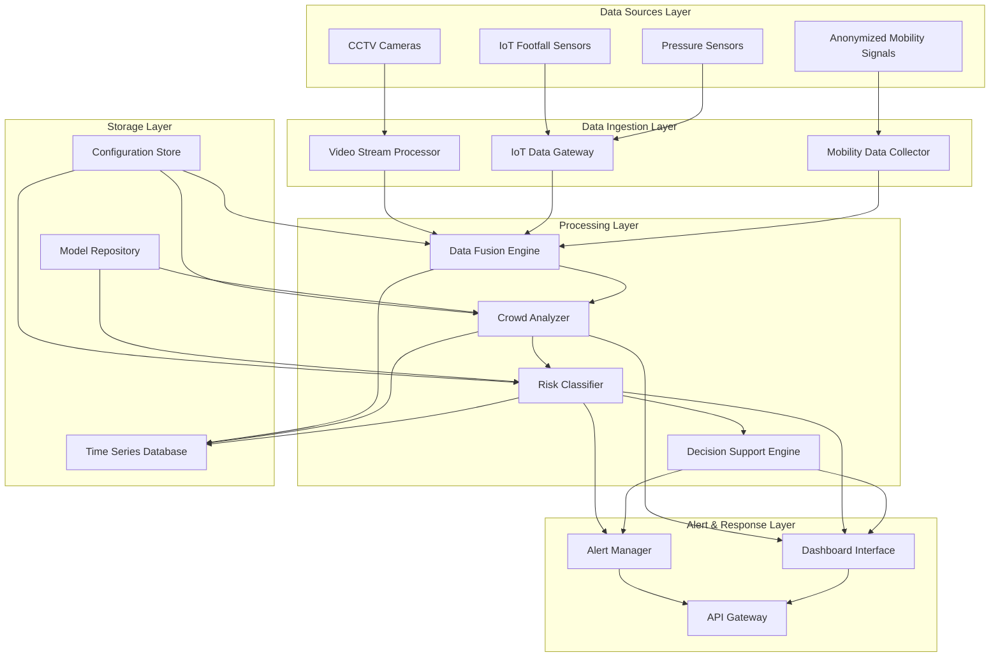

# Design Document: AI-Driven Crowd Management and Public Safety System

## Overview

The AI-driven Crowd Management and Public Safety System is a comprehensive platform that leverages multi-sensor data fusion, deep learning, and real-time analytics to monitor crowd behavior, predict risks, and provide automated decision support for public safety. The system integrates data from CCTV cameras, IoT footfall sensors, pressure sensors, and anonymized mobility signals to create a unified view of crowd dynamics.

The architecture follows a modular, microservices-based approach with real-time data processing pipelines, enabling scalable deployment across various environments from small gatherings to large-scale events with 100,000+ attendees.

## Architecture

The system employs a layered architecture with the following key components:



### Core Processing Pipeline

1. **Data Ingestion**: Multi-source data streams are processed and normalized
2. **Data Fusion**: Sensor data is combined using weighted fusion algorithms
3. **Crowd Analysis**: AI models analyze crowd density, movement patterns, and behavior
4. **Risk Assessment**: Machine learning classifiers determine risk levels
5. **Decision Support**: Recommendation engine generates actionable insights
6. **Alert Distribution**: Automated notifications sent to relevant authorities

## Components and Interfaces

### Data Fusion Engine

**Purpose**: Combines heterogeneous sensor data into unified crowd metrics

**Key Functions**:
- Temporal synchronization of multi-source data streams
- Spatial correlation mapping between sensor coverage areas
- Weighted fusion algorithms based on sensor reliability and coverage
- Data quality assessment and outlier detection

**Interfaces**:
- Input: Raw sensor data streams (video, IoT, mobility)
- Output: Fused crowd metrics (density maps, flow vectors, occupancy levels)
- Configuration: Sensor weights, fusion parameters, quality thresholds

### Crowd Analyzer

**Purpose**: Processes fused data to extract crowd behavior insights using deep learning

**AI Models**:
- **Density Estimation Network**: CNN-based model for crowd density mapping
- **Flow Analysis Network**: Optical flow-based movement pattern detection
- **Behavior Classification Network**: RNN-based abnormal behavior detection

**Key Functions**:
- Real-time crowd density calculation per zone (people/m²)
- Movement pattern analysis and flow direction detection
- Congestion hotspot identification
- Temporal trend analysis for predictive insights

**Interfaces**:
- Input: Fused sensor data, venue configuration
- Output: Crowd metrics, movement patterns, density maps
- Models: Pre-trained deep learning models for crowd analysis

### Risk Classifier

**Purpose**: Categorizes crowd conditions into risk levels using machine learning

**Risk Categories**:
- **Safe**: Density < 2 people/m², normal flow patterns
- **Warning**: Density 2-4 people/m², slight congestion detected
- **High Risk**: Density 4-6 people/m², significant congestion or abnormal patterns
- **Critical**: Density > 6 people/m², stampede risk indicators present

**Classification Features**:
- Crowd density levels across zones
- Movement pattern anomalies
- Rate of density change
- Exit accessibility ratios
- Historical incident patterns

**Interfaces**:
- Input: Crowd analysis results, venue capacity data
- Output: Risk level classifications, confidence scores
- Configuration: Risk thresholds, venue-specific parameters

### Decision Support Engine

**Purpose**: Generates actionable recommendations based on risk assessments

**Recommendation Types**:
- **Crowd Redirection**: Alternative route suggestions during congestion
- **Gate Control**: Entry/exit management recommendations
- **Resource Deployment**: Optimal positioning for security and medical teams
- **Communication**: Public announcement content and timing

**Decision Logic**:
- Rule-based system for immediate responses
- Machine learning models for optimal resource allocation
- Multi-objective optimization for conflicting constraints

**Interfaces**:
- Input: Risk classifications, venue layout, available resources
- Output: Prioritized action recommendations, implementation timelines
- Configuration: Response protocols, resource availability

### Alert Manager

**Purpose**: Distributes notifications and manages communication workflows

**Alert Channels**:
- SMS notifications for immediate alerts
- Email reports for detailed information
- Push notifications through mobile applications
- Integration with emergency response systems

**Alert Logic**:
- Escalation procedures based on risk levels
- Recipient filtering based on roles and locations
- Rate limiting to prevent alert fatigue
- Acknowledgment tracking and follow-up procedures

**Interfaces**:
- Input: Risk classifications, recommendations, recipient lists
- Output: Multi-channel notifications, delivery confirmations
- Configuration: Contact lists, escalation rules, message templates

## Data Models

### Sensor Data Model

```typescript
interface SensorReading {
  sensorId: string;
  timestamp: Date;
  sensorType: 'camera' | 'footfall' | 'pressure' | 'mobility';
  location: GeoCoordinate;
  data: CameraData | FootfallData | PressureData | MobilityData;
  quality: number; // 0-1 reliability score
}

interface CameraData {
  frameId: string;
  resolution: Resolution;
  detectedObjects: DetectedObject[];
  crowdDensity: number;
}

interface FootfallData {
  count: number;
  direction: 'in' | 'out' | 'bidirectional';
  confidence: number;
}

interface PressureData {
  pressure: number; // kPa
  area: number; // m²
  estimatedWeight: number; // kg
}

interface MobilityData {
  deviceCount: number;
  movementVectors: MovementVector[];
  dwellTime: number; // seconds
}
```

### Crowd Analysis Model

```typescript
interface CrowdMetrics {
  zoneId: string;
  timestamp: Date;
  density: number; // people per m²
  occupancy: number; // current count
  capacity: number; // maximum safe capacity
  flowRate: number; // people per minute
  movementPatterns: MovementPattern[];
  congestionLevel: 'none' | 'light' | 'moderate' | 'heavy';
}

interface MovementPattern {
  direction: number; // degrees from north
  velocity: number; // m/s
  confidence: number;
  participantCount: number;
}
```

### Risk Assessment Model

```typescript
interface RiskAssessment {
  assessmentId: string;
  timestamp: Date;
  zoneId: string;
  riskLevel: 'Safe' | 'Warning' | 'High Risk' | 'Critical';
  confidence: number;
  riskFactors: RiskFactor[];
  predictedTrend: 'improving' | 'stable' | 'deteriorating';
  timeToEscalation?: number; // minutes until next risk level
}

interface RiskFactor {
  factor: string;
  severity: number; // 0-1 scale
  description: string;
}
```

### Decision Support Model

```typescript
interface Recommendation {
  recommendationId: string;
  timestamp: Date;
  priority: 'low' | 'medium' | 'high' | 'critical';
  category: 'crowd_redirection' | 'gate_control' | 'resource_deployment' | 'communication';
  action: string;
  targetZones: string[];
  estimatedImpact: string;
  implementationTime: number; // minutes
  resources: RequiredResource[];
}

interface RequiredResource {
  type: 'personnel' | 'equipment' | 'infrastructure';
  quantity: number;
  location: GeoCoordinate;
}
```

Now I need to use the prework tool to analyze the acceptance criteria before writing the Correctness Properties section.

<function_calls>
<invoke name="prework">
<parameter name="featureName">ai-crowd-management-system

## Correctness Properties

*A property is a characteristic or behavior that should hold true across all valid executions of a system—essentially, a formal statement about what the system should do. Properties serve as the bridge between human-readable specifications and machine-verifiable correctness guarantees.*

### Property 1: Multi-sensor data integration
*For any* combination of available sensor types (CCTV, footfall, pressure, mobility), the Data_Fusion_Engine should successfully process and integrate all available data sources into unified crowd metrics, maintaining operation even when some sensor types are unavailable.
**Validates: Requirements 1.1, 1.2, 1.3, 1.4, 1.5**

### Property 2: Real-time processing performance
*For any* incoming sensor data, the system should process and analyze the data within specified time limits: Crowd_Analyzer within 5 seconds, Risk_Classifier within 3 seconds, and system updates at least every 10 seconds.
**Validates: Requirements 2.1, 2.4, 3.5**

### Property 3: Crowd analysis accuracy and format
*For any* crowd data analysis, the Crowd_Analyzer should calculate density per square meter for defined zones, identify movement patterns when present, and maintain accuracy above 85% for density estimation.
**Validates: Requirements 2.2, 2.3, 2.5**

### Property 4: Risk classification consistency
*For any* crowd conditions, the Risk_Classifier should categorize situations using exactly four levels (Safe, Warning, High Risk, Critical), apply density thresholds correctly (Warning+ for >4 people/m²), and escalate appropriately when multiple risk factors are present.
**Validates: Requirements 3.1, 3.2, 3.3, 3.4**

### Property 5: Alert delivery timing and content
*For any* high-risk or critical situation, the Alert_Manager should deliver alerts within specified timeframes (10s for High Risk, 5s for Critical), include required information (location, risk level, crowd size), and support all configured communication channels.
**Validates: Requirements 4.1, 4.2, 4.3, 4.4**

### Property 6: Alert persistence and follow-up
*For any* persistent alert condition, the Alert_Manager should send follow-up notifications every 2 minutes until acknowledged, maintaining alert state consistency throughout the process.
**Validates: Requirements 4.5**

### Property 7: Decision support recommendation generation
*For any* high-risk or critical situation, the Decision_Support_Engine should generate appropriate recommendations (redirection for congestion, gate control for exit overcrowding, rescue deployment for stampede risk) and prioritize them based on severity and feasibility.
**Validates: Requirements 5.1, 5.2, 5.3, 5.4, 5.5**

### Property 8: Privacy preservation
*For any* data processing operation, the system should maintain privacy by processing only anonymized mobility signals, avoiding facial recognition in video analysis, and encrypting all data transmissions.
**Validates: Requirements 6.1, 6.2, 6.4**

### Property 9: Data retention compliance
*For any* raw sensor data, the system should automatically delete it after 24 hours unless flagged for incident investigation, maintaining compliance with data retention policies.
**Validates: Requirements 6.3**

### Property 10: Scalability across environments
*For any* deployment environment (urban with dense sensors or rural with limited sensors), the system should operate effectively, support events from 1,000 to 100,000 attendees, and scale processing capacity as event size increases.
**Validates: Requirements 7.1, 7.2, 7.3, 7.4**

### Property 11: Performance consistency at scale
*For any* deployment scale, the system should maintain response times under 10 seconds regardless of the number of sensors or attendees.
**Validates: Requirements 7.5**

### Property 12: Fault tolerance and degraded operation
*For any* sensor failure scenario, the system should continue operating with remaining sensors, maintain at least 90% functionality when up to 30% of sensors are unavailable, and detect malfunctions within 60 seconds.
**Validates: Requirements 8.1, 8.2, 8.4**

### Property 13: Network resilience and power backup
*For any* network connectivity issues or power outages, the system should buffer critical alerts for later transmission and maintain critical component operation through backup power systems.
**Validates: Requirements 8.3, 8.5**

### Property 14: Configuration management
*For any* configuration changes (density thresholds, venue definitions, alert recipients), the system should apply changes correctly, maintain configuration history, and support rollback to previous settings.
**Validates: Requirements 9.1, 9.2, 9.4, 9.5**

### Property 15: Calibration procedures
*For any* new venue deployment, the system should provide and execute calibration procedures for the sensor network to ensure accurate operation.
**Validates: Requirements 9.3**

### Property 16: Comprehensive monitoring and reporting
*For any* system operation, the system should provide real-time dashboards, generate hourly reports, produce post-event analysis reports, track performance metrics, and maintain audit logs of all alerts and recommendations.
**Validates: Requirements 10.1, 10.2, 10.3, 10.4, 10.5**

## Error Handling

The system implements comprehensive error handling across all components:

### Data Processing Errors
- **Sensor Malfunction**: Automatic detection and isolation of faulty sensors
- **Data Quality Issues**: Validation and filtering of corrupted or incomplete data
- **Processing Failures**: Graceful degradation with fallback algorithms
- **Model Inference Errors**: Confidence scoring and uncertainty quantification

### Communication Errors
- **Network Failures**: Alert buffering and retry mechanisms
- **Delivery Failures**: Multi-channel redundancy and escalation procedures
- **Authentication Issues**: Secure credential management and rotation

### System Errors
- **Resource Exhaustion**: Auto-scaling and load balancing
- **Component Failures**: Health monitoring and automatic restart procedures
- **Configuration Errors**: Validation and rollback capabilities

### Recovery Procedures
- **Automatic Recovery**: Self-healing mechanisms for transient failures
- **Manual Intervention**: Clear escalation paths for persistent issues
- **Data Recovery**: Backup and restore procedures for critical data
- **Service Continuity**: Failover mechanisms to maintain core functionality

## Testing Strategy

The system employs a dual testing approach combining unit tests for specific scenarios and property-based tests for comprehensive validation:

### Unit Testing
- **Component Integration**: Test interfaces between system components
- **Edge Cases**: Validate behavior at system boundaries and limits
- **Error Conditions**: Verify proper error handling and recovery
- **Configuration Scenarios**: Test various deployment configurations
- **Performance Benchmarks**: Validate timing requirements under controlled conditions

### Property-Based Testing
- **Universal Properties**: Validate correctness properties across all possible inputs
- **Randomized Testing**: Generate diverse test scenarios automatically
- **Minimum 100 iterations**: Each property test runs at least 100 randomized cases
- **Property Traceability**: Each test references its corresponding design property
- **Tag Format**: **Feature: ai-crowd-management-system, Property {number}: {property_text}**

### Testing Framework Selection
- **Python**: Use Hypothesis for property-based testing
- **TypeScript/JavaScript**: Use fast-check for property-based testing
- **Java**: Use jqwik for property-based testing
- **Integration Testing**: Use Docker containers for multi-component testing

### Test Coverage Requirements
- **Code Coverage**: Minimum 85% line coverage for all components
- **Property Coverage**: All 16 correctness properties must have corresponding tests
- **Scenario Coverage**: Test all risk levels and alert conditions
- **Performance Testing**: Validate timing requirements under various loads
- **Failure Testing**: Simulate sensor failures and network issues

The testing strategy ensures both specific correctness (unit tests) and general correctness (property tests) while maintaining traceability to requirements and design properties.